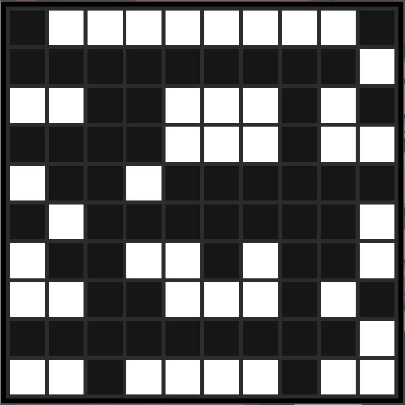

# Conway's Game Of Life



## Uso
En la raíz del projecto ejecuta:

```bash
buckaroo install
buck run gameoflife
```

## Controles
- &#8592;: Scroll a la izquierda
- &#8593;: Scroll hacia arriba
- &#8594;: Scroll a la derecha
- &#8595;: Scroll hacia abajo
- i: Zoom in
- o: Zoom out
- p: Pause
- click: Invierte el estado de la celda seleccionada
- f: Aumentar velocidad de animación
- s: Disminuir velocidad de animación
- u: Forzar actualización
- r: Forzar redibujado
- w: Guardar configuración actual

## Configuración
Ejecuta el siguiente comando para ver las opciones de configuración disponibles:

```bash
buck run gameoflife -- --help
```

```txt
Game options:
  --help                         Shows available options
  --config arg (=GAMEOFLIFE.cfg) configuration file
  --rows arg                     Number of rows
  --cols arg                     Number of cols
  --module-indexes arg           Module indexes of grid when updating
  --speed-factor arg             Single update speed increment
  --max-update-rate arg          Maximum update rate in milliseconds
  --min-update-rate arg          Minimum update rate in milliseconds
  --density arg                  Initial alive cells density
  --folder arg                   Folder where configurations will be stored
  --load-matrix arg              Matrix configuration to load

Window options:
  --cell-size arg                Size of each cell in pixels
  --window-w arg                 Width of screen in pixels
  --window-h arg                 Height of screen in pixels
  --zoom-factor arg              Zoom factor
  --zoom-default arg             Zoom default
  --margin arg                   Margin of screen in pixels
  --scroll-amount arg            Number of pixels to scroll
  --draw-grid-lines arg          Draw lines between cells in the grid

Dev options:
  --debug arg                    Activate debug mode

Cloud options:
  --local arg                    Execute game in local computer or in the cloud
  --host arg                     Orchestrator host
  --port arg                     Orchestrator port
  --az-orchestrator arg          Url of azure orchestrator function
  --az-orchestrator-code arg     Code for azure orchestrator function
  --orchestrator-standalone arg  Determines if orchestrator is standalone
```

Tambien se puede usar un archivo de configuración para el juego. [Ejemplo](https://github.com/DanielMontesGuerrero/simulations/blob/develop/GAMEOFLIFE.cfg).

## Modo de ejecución
### Ejecución local
La configuración necesaria del archivo [GAMEOFLIFE.cfg](https://github.com/DanielMontesGuerrero/simulations/blob/develop/GAMEOFLIFE.cfg) para ejecutarlo en modo local es:
```txt
local=true
```

### Ejecución distribuida
La configuración necesaria del archivo [GAMEOFLIFE.cfg](https://github.com/DanielMontesGuerrero/simulations/blob/develop/GAMEOFLIFE.cfg) para ejecutarlo en modo distribuido es:
```txt
local=false
orchestrator-standalone=false
host=<ORCHESTRATOR_IP>
port=<ORCHESTRATOR_PORT>
```

### Ejecución en azure
Seguir los scripts en [azure/azureScripts](../azure/azureScripts) para crear los recursos en azure.

La configuración necesaria del archivo [GAMEOFLIFE.cfg](https://github.com/DanielMontesGuerrero/simulations/blob/develop/GAMEOFLIFE.cfg) para ejecutarlo en modo distribuido en azure es:
```txt
local=false
orchestrator-standalone=false
host=<ORCHESTRATOR_IP>
port=<ORCHESTRATOR_PORT>
az-orchestrator=<URL_TO_FUNCTION_APP>
az-orchestrator-code=<FUNCTION_APP_CODE>
```

#### Ejecución del orquestrador y los nodos worker
[Ver](../gameoflifeServer/README.md)
