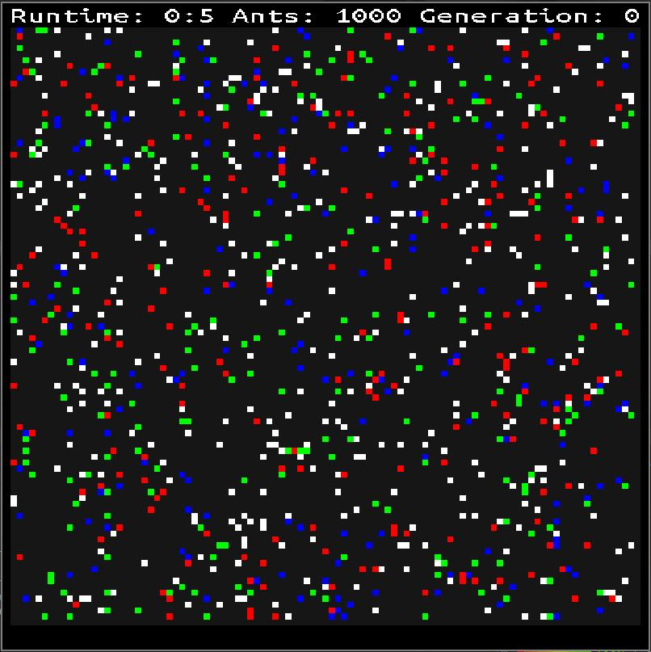

# Langton's Ant



## Uso
En la raíz del projecto ejecuta:

```bash
buckaroo install
buck run langtonant
```

## Controles
- &#8592;: Scroll a la izquierda
- &#8593;: Scroll hacia arriba
- &#8594;: Scroll a la derecha
- &#8595;: Scroll hacia abajo
- i: Zoom in
- o: Zoom out
- p: Pause
- click: Invierte el estado de la celda seleccionada
- f: Aumentar velocidad de animación
- s: Disminuir velocidad de animación
- u: Forzar actualización
- r: Forzar redibujado
- w: Guardar configuración actual

## Configuración
Ejecuta el siguiente comando para ver las opciones de configuración disponibles:

```bash
buck run gameoflife -- --help
```

```txt
Game options:
  --help                                Shows available options
  --ants-distribution arg (=0.5)        Ant's distribution density
  --ants-densities arg                  Ant type distribution
  --queen-battle-max-age-diff arg (=60) If one of the queen ants is older by
                                        this difference his probability to
                                        sorvive will be lesser
  --queen-battle-disadvantge-prob arg (=0.200000003)
                                        This is the probability to survive when
                                        an old queen ant fights a younger queen
                                        ant
  --ant-death-age arg (=80)             Max ant age
  --config arg (=LANGTONANT.cfg)        configuration file
  --rows arg                            Number of rows
  --cols arg                            Number of cols
  --speed-factor arg                    Single update speed increment
  --max-update-rate arg                 Maximum update rate in milliseconds
  --min-update-rate arg                 Minimum update rate in milliseconds
  --folder arg                          Folder where configurations will be
                                        stored
  --load-state arg                      Matrix configuration to load

Window options:
  --cell-size arg                       Size of each cell in pixels
  --window-w arg                        Width of screen in pixels
  --window-h arg                        Height of screen in pixels
  --zoom-factor arg                     Zoom factor
  --zoom-default arg                    Zoom default
  --margin arg (=10)                    Margin of screen in pixels
  --scroll-amount arg                   Number of pixels to scroll
  --draw-grid-lines arg                 Draw lines between cells in the grid

Dev options:
  --debug arg                           Activate debug mode
```


Tambien se puede usar un archivo de configuración para el juego. [Ejemplo](https://github.com/DanielMontesGuerrero/simulations/blob/develop/LANGTONANT.cfg).
